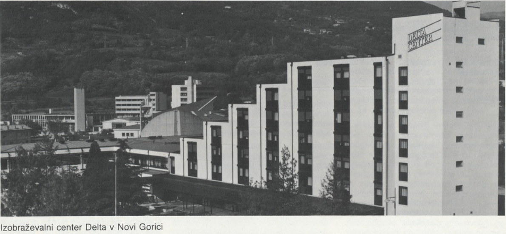
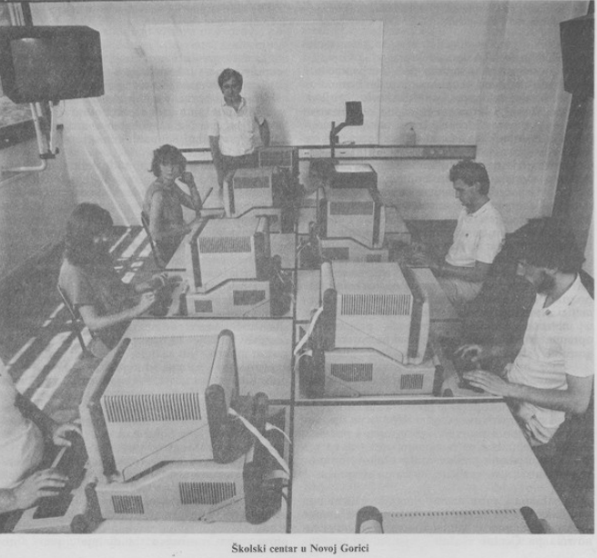
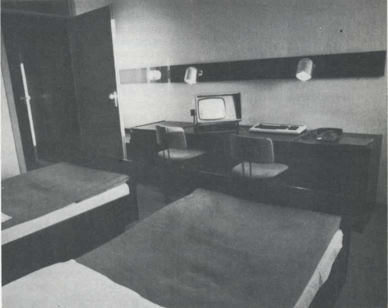

# Izobraževalni center Delta

Izobraževalni center Delta je v Novi Gorici začel delovati jeseni leta 1985, ko so prenovili zapuščen hotel Argonavti. Center je je bil 
sestavljen iz treh delov – hotelskega, izobraževalnega in rekreacijskega. V hotelskem delu je bilo na voljo 200  ležišč, izobraževalni del 
pa se je delil na upravne prostore, kabinete za inštruktorje in učilnice. Učilnic je bilo 20 s skupaj 350 sedeži. Vse učilnice so bile 
opremljene s terminali ali računalniki ter drugimi ustreznimi aparaturami in učnimi pripomočki. Rekreacijski del je med drugim vključeval 
bazen, savno in teniška igrišča. 
Seminarji so običajno potekali 5 dni, na teden so v centru izvedli od sedem do enajst seminarjev za sto do dvesto udeležencev. Šolanje so 
izvajali z lastnimi strokovnjaki na najmodernejši način, z interaktivno uporabo računalnika. Seminarji so bili sestavljeni iz teoretičnega 
in praktičnega dela. Teoretični del je potekal v sodobno opremljenih učilnicah z grafoskopi in monitorji, povezanimi s terminalom predavatelja. 
Praktični del seminarja je pomenil delo na sistemu, organiziranem v individualni obliki, v sodobni učilnici za interaktivno delo. Na 
posameznem videoterminalu sta istočasno delala le dva udeleženca seminarja, kar je omogočalo kolektivno delo z medsebojno izmenjavo informacij 
ob individualno zastavljeni zasnovi. 
Dvakrat letno so izdali tudi brošuro z opisom tečajev in s programom seminarjev. Tečaje so razvrstili po področjih v tematske skupine:
 
Sistemske in aplikacijske programske opreme: Informatika, Jeziki, Informacijska orodja, Uporabniške aplikacije, Izobraževanje in računalništvo, Uporabniki in informatika.
 
Sistemi: Operacijski sistemi, Komunikacije, Aparaturna oprema, Vhodno – izhodno enote, Računalniški sistemi.
 
Druga znanja: Ekonomsko-pravna znanja, Poslovna politika in organizacija, Družboslovna znanja, Delovno okolje, Živi jeziki in Posebne storitve.

  
Slika 1: Izobraževalni center v Novi Gorici

  
Slika 2: Učilnica, kjer je potekal praktični del seminarja

  
Slika 3: Učilnica, kjer je potekal teoretični del seminarja

  
Slika 4: Hotelska soba izobraževalnega centra

  
Slika 5: Del rekreacijskega dela centra
