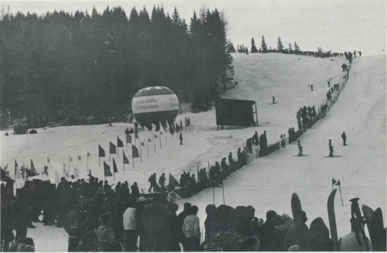
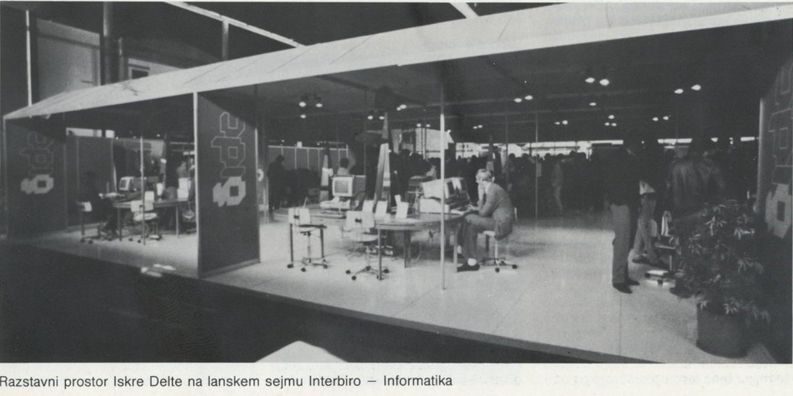
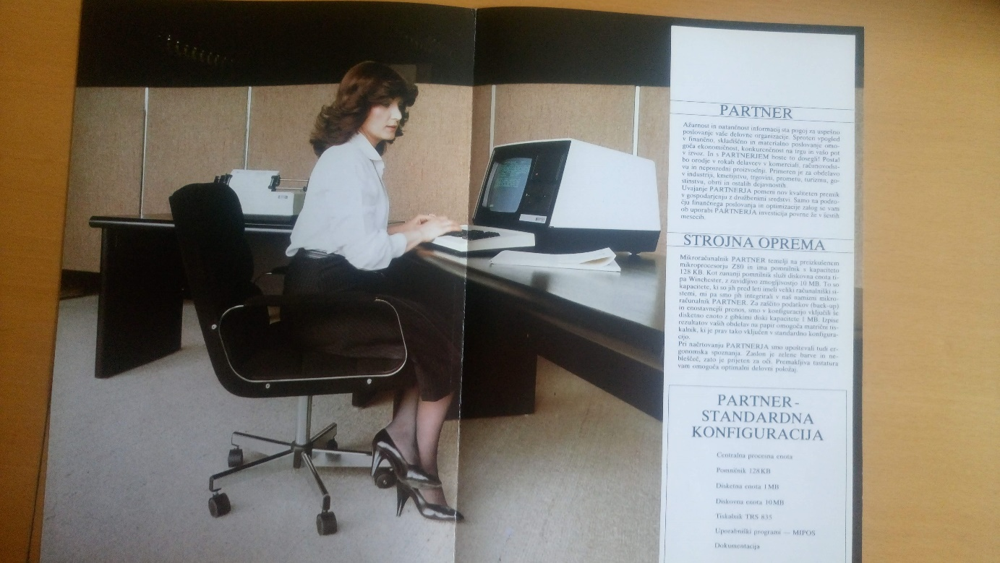

# Uveljavljanje v svetu

Že v letu 1980 je Iskra Delta ustanovila predstavništvo v New Yorku in navezovala stike z
ameriškimi dobavitelji ter bila tako seznanjena z najnovejšimi razvojnimi dosežki v Silicijevi
dolini. Izdelali so nova računalnika, Partner in Triglav (za internacionalne kupce Trident), leta
1984 pa prvi izvedli projekt računalniškega upravljanja in vodenja hidroelektrarne na daljavo.
Prav tako je s svojimi računalniki sodelovala pri športnih prireditvah, kot so bili skoki v
Planici, smučarska tekmovanja v Kranjski gori in Mariboru ter Zimska Univerzijada na
Čehoslovaškem. Njihovo sodelovanje je pomenilo popolno informacijsko podporo, evidenco
sodelujočih ter zbiranje in distribucijo rezultatov na različnih lokacijah.

Slika 1: Fotografija z Zimske univerzijade na Češkoslovaškem, na kateri je opazen reklamni balon z logotipom Iskra Delta Computers.

V času delovanju so svoje izdelke vestno predstavljali na Interbiro sejmih v Ljubljani in
Zagrebu ter s tem privabljali tudi veliko tujih strank. Prav na sejmu leta 1984 so bili nad
dosežki Iskre Delte navdušeni predstavniki Ljudske republike Kitajske, ki so od podjetja
želeli, da skupaj uresničijo projekt, ki bi računalniško povezal policijske postaje desetih
največjih mest na Kitajskem. Iskra Delta je predlog sprejela in leta 1986 tudi uspešno
realizirala gromozanski projekt. Takrat je bil ta projekt največji nakup Kitajske sploh v
Jugoslaviji, ki je ti dve državi tudi povezal. Vseeno pa je prišlo pri uresničitvi tega projekta do
določenih zapletov. Sodelovanje Jugoslavije s Kitajsko je pritegnilo pozornost vzhodnih in
kitajskih obveščevalnih služb.

Slika 2: Razstavni prostor Iskre Delta na sejmu Interbiro.

Konec leta 1986 se je Iskra Delta lahko pohvalila z dolgim seznamom proizvodov in uspešnih
projektov, med katere spadajo računalniki Paka, Partner in Triglav, ki je bil pod imenom
Trident na mednarodnem sejmu v nemškem Leipzigu izbran za najboljši računalnik v odprti
konkurenci z Zahoda, Vzhoda in Daljnega vzhoda; programska oprema in sistemi Delta 800,
PDP 11, Delta 8000, Gemini in IDA; projekt LAN, Projekt komunikacij, projekt DIPS 85 in
Projekt aplikativnih branž. Vsi ti uspehi in dejstvo, da majhno podjetje obvladuje tehnologijo,
ki se jih je v takrat dalo dobiti le s strani ZDA, navdušijo tudi vodstvo Republike Indije, ki
leta 1988 v Jugoslavijo pošlje državno delegacijo s predsednikom Rajivom Gandhijem na
čelu. Tudi z njimi se Iskra Delta uspešno dogovori za sodelovanje in ustanovitev mešanega
podjetja v Indiji.

Slika 3: Reklamna fotografija za računalnik Partner.

Slika 4: Računalnik Triglav (Trident).
